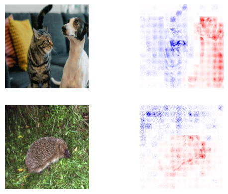

<p align="center">
 
</p>

<center>
<h1>Advancing Attribution-Based Explainability through Multi-Component Evaluation and Relative Absolute Magnitude Propagation</h1>
</center>

## 🤖 Visualize Vision Transformer attribution maps and more!

This repository contains the source code for the new __Absolute Magnitude Layer-Wise Relevance Propagation__ attribution method and the __Global Evaluation Metric__ described in the paper https://dl.acm.org/doi/10.1145/3649458 .

## 🔎 Absolute Magnitude Layer-Wise Relevance Propagation

A novel Layer-Wise Propagation rule, referred to as **Abs**olute Magnitude **L**ayer-Wise **R**elevance **P**ropagation (__absLRP__). This rule effectively addresses the issue of incorrect relative attribution between neurons within the same layer that exhibit varying absolute magnitude activations. We apply this rule to three different architectures, including the very recent Vision Transformer.


*Figure 1. absLRP visualizations for Vision Transformer architecture - PascalVOC*


*Figure 2. absLRP visualizations for VGG architecture - ImageNet*

### 🔬 Usage
<details>
<summary>Import required modules</summary>

```python
import torch
from abslrp_gae.abslrp.rules.models import VGGAbsLRPRule, ResNetAbsLRPRule, VisionTransformerAbsLRPRule
from abslrp_gae.abslrp.relevancy_methods import AbsLRPRelevancyMethod
from abslrp_gae.utils import preprocess_image, visualize_batch
import timm
from timm.models.vision_transformer import VisionTransformer
from PIL import Image
```

</details>

Load a model from **timm** and apply the **absLRP** rule:
```python
# load the model
device = "cuda"
model = timm.create_model("vit_base_patch16_224", pretrained=True)
# model = timm.create_model("vgg16", pretrained=True)
# model = timm.create_model("resnet50", pretrained=True)
model.eval()
model.to(device)

# apply the absLRP rule to the model
VisionTransformerAbsLRPRule().apply(model)
# VGGAbsLRPRule().apply(model)
# ResNetAbsLRPRule().apply(model)
```
Load inference images and preprocess:
```python
is_vit = isinstance(model, VisionTransformer)
x = torch.stack(
    [
        preprocess_image(Image.open("images/dog_cat.jpeg"), is_vit),
        preprocess_image(Image.open("images/hedgehog.jpg"), is_vit),
    ]
)
```
Calculate contrastive relevance using absLRP and visualize:
```python
relevancy_method = AbsLRPRelevancyMethod(model, device)
relevance = relevancy_method.relevancy(x)
visualize_batch(x, relevance, is_vit)
```
<center>



</center>

## 📊 Global Evaluation Metric

A new evaluation method, Global Attribution Evaluation (GAE), which offers a novel perspective on evaluating faithfulness and robustness of an attribution method by utilizing gradient-based masking, while combining those results with a localization method to achieve a comprehensive evaluation of explanation quality in a single score.


*Figure 3. Top and bottom 5 scoring images on GAE metric out of a randomly sampled 1024 images - absLRP VGG ImageNet*

### 🔬 Usage

Import the required libraries
```python
from abslrp_gae.gae.gae import GlobalEvaluationMetric
```
Define a dictionary of relevancy methods:
```python
relevancy_methods = {
    "abslrp": relevancy_method,
}
```
Run the metric
```python
metric = GlobalEvaluationMetric()
metric.run(
    relevancy_methods=relevancy_methods,
    model=base_model, # original model
    dataset=dataset,
    batch_size=16,
    )
```
Plot the results
```python
metric.plot()
```

## 📞 Contact
[](https://www.linkedin.com/in/davor-vukadin-596aaa1b7/)

## 🔗 Citation
Please use the following BibText entry to cite our work:
```bibtex
@article{10.1145/3649458,
author = {Vukadin, Davor and Afri\'{c}, Petar and \v{S}ili\'{c}, Marin and Dela\v{c}, Goran},
title = {Advancing Attribution-Based Neural Network Explainability through Relative Absolute Magnitude Layer-Wise Relevance Propagation and Multi-Component Evaluation},
year = {2024},
issue_date = {June 2024},
publisher = {Association for Computing Machinery},
address = {New York, NY, USA},
volume = {15},
number = {3},
issn = {2157-6904},
url = {https://doi.org/10.1145/3649458},
doi = {10.1145/3649458},
journal = {ACM Trans. Intell. Syst. Technol.},
month = {apr},
articleno = {47},
numpages = {30},
keywords = {Explainable artificial intelligence, Vision Transformer, layer-wise relevance propagation, attribution-based evaluation}
}
```
