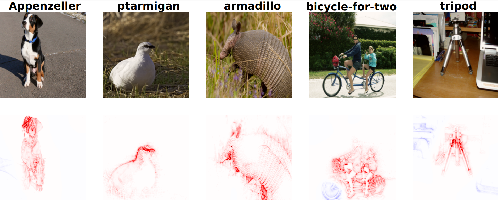
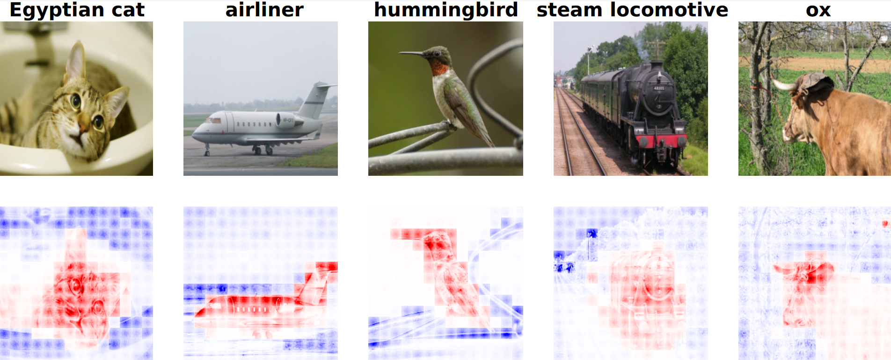
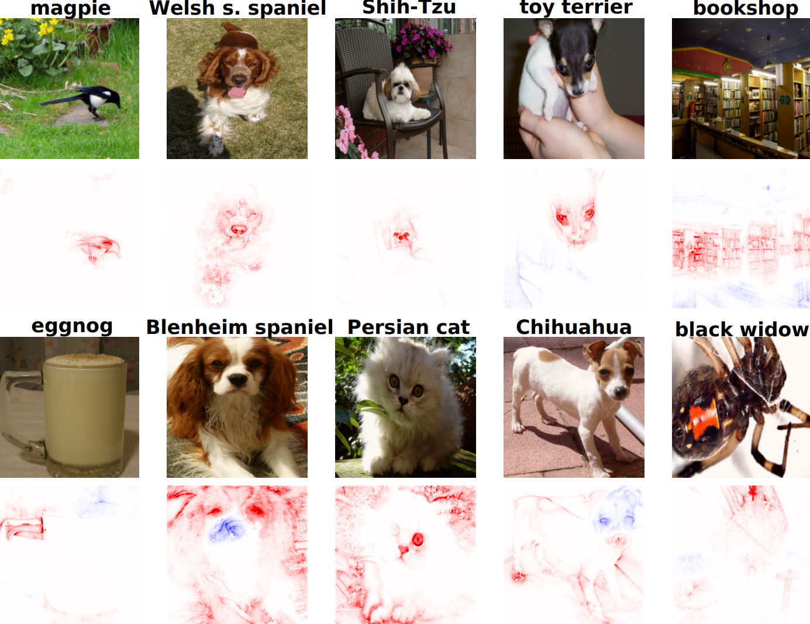

# Advancing Attribution-Based Explainability through Multi-Component Evaluation and Relative Absolute Magnitude Propagation

This repository contains the source code for the new __Relative Absolute Magnitude Propagation__ attribution method and the __Global Evaluation Metric__ described in the paper https://dl.acm.org/doi/10.1145/3649458 .

## Relative Absolute Magnitude Propagation

A novel Layer-Wise Propagation rule, referred to as Relative Absolute Magnitude Propagation (RAMP). This rule effectively addresses the issue of incorrect relative attribution between neurons within the same layer that exhibit varying absolute magnitude activations. We apply this rule to three different, including the very recent Vision Transformer.


*Figure 1. RAMP visualizations for VGG architecture - ImageNet*


*Figure 2. RAMP visualizations for Vision Transformer architecture - PascalVOC*

## Global Evaluation Metric

A new evaluation method, Global Attribution Evaluation (GAE), which offers a novel perspective on evaluating faithfulness and robustness of an attribution method by utilizing gradient-based masking, while combining those results with a localization method to achieve a comprehensive evaluation of explanation quality in a single score.


*Figure 3. Top and bottom 5 scoring images on GAE metric out of a randomly sampled 1024 images - RAMP VGG ImageNet*

### Usage Example
#### Relative Absolute Magnitude Propagation
Import the required libraries
```
import torch
from torchvision.transforms.functional import pil_to_tensor
import torchvision.transforms as T
from PIL import Image
import timm
from ramp_gae.ramp.models import TimmVGG16, TimmResNet, TimmVisionTransformer
from ramp_gae.ramp.relevancy_methods import IntRelevancyMethod
from ramp_gae.utils import preprocess_pil_image, visualize_tensor_relevance_batch
```
Load a model from timm and wrap it inside the RAMP class
```
device = 'cuda'
# model = timm.create_model('vgg16', pretrained=True)
# ramp_model = TimmVGG16(model)
# model = timm.create_model('resnet50', pretrained=True)
# ramp_model = TimmResNet(model)
model = timm.create_model('vit_base_patch16_224', pretrained=True)
ramp_model = TimmVisionTransformer(model)
ramp_model.to(device)
ramp_model.eval()
is_vit = isinstance(ramp_model, TimmVisionTransformer)
relevancy_method = IntRelevancyMethod(ramp_model, rule='intline', relevancy_type='contrastive', device=device)
```
Load an inference image and preprocess
```
image = Image.open(image_path)
image = preprocess_pil_image(image, is_vit=is_vit)
```
Calculate contrastive relevance using RAMP and visualize
```
x = image.unsqueeze(0)
r, _, _ = relevancy_method.relevancy(x, choose_max=True)
visualize_tensor_relevance_batch(x, r, is_vit=is_vit)
```

#### Global Evaluation Metric
Import the required libraries
```
from ramp_gae.gae.gae import GlobalEvaluationMetric, IndexReturnDataset
```
Wrap your dataset inside IndexReturnDataset
```
test_loader = DataLoader(IndexReturnDataset(dataset), batch_size=4, shuffle=True)
```
Define a dictionary of relevancy methods (key - method name, value - relevancy method) to evaluate.
In this case, our RAMP method from the example above:
```
relevancy_methods = {
    'ramp': relevancy_method,
}
```
Run the metric
```
metric.run()
```
Plot the results
```
metric.plot_results()
```

### Citation
Please use the following BibText entry to cite our work:
```
@article{10.1145/3649458,
author = {Vukadin, Davor and Afri\'{c}, Petar and \v{S}ili\'{c}, Marin and Dela\v{c}, Goran},
title = {Advancing Attribution-Based Neural Network Explainability through Relative Absolute Magnitude Layer-Wise Relevance Propagation and Multi-Component Evaluation},
year = {2024},
issue_date = {June 2024},
publisher = {Association for Computing Machinery},
address = {New York, NY, USA},
volume = {15},
number = {3},
issn = {2157-6904},
url = {https://doi.org/10.1145/3649458},
doi = {10.1145/3649458},
abstract = {Recent advancement in deep-neural network performance led to the development of new state-of-the-art approaches in numerous areas. However, the black-box nature of neural networks often prohibits their use in areas where model explainability and model transparency are crucial. Over the years, researchers proposed many algorithms to aid neural network understanding and provide additional information to the human expert. One of the most popular methods being Layer-Wise Relevance Propagation (LRP). This method assigns local relevance based on the pixel-wise decomposition of nonlinear classifiers. With the rise of attribution method research, there has emerged a pressing need to assess and evaluate their performance. Numerous metrics have been proposed, each assessing an individual property of attribution methods such as faithfulness, robustness, or localization. Unfortunately, no single metric is deemed optimal for every case, and researchers often use several metrics to test the quality of the attribution maps. In this work, we address the shortcomings of the current LRP formulations and introduce a novel method for determining the relevance of input neurons through layer-wise relevance propagation. Furthermore, we apply this approach to the recently developed Vision Transformer architecture and evaluate its performance against existing methods on two image classification datasets, namely ImageNet and PascalVOC. Our results clearly demonstrate the advantage of our proposed method. Furthermore, we discuss the insufficiencies of current evaluation metrics for attribution-based explainability and propose a new evaluation metric that combines the notions of faithfulness, robustness, and contrastiveness. We utilize this new metric to evaluate the performance of various attribution-based methods. Our code is available at:},
journal = {ACM Trans. Intell. Syst. Technol.},
month = {apr},
articleno = {47},
numpages = {30},
keywords = {Explainable artificial intelligence, Vision Transformer, layer-wise relevance propagation, attribution-based evaluation}
}
```
