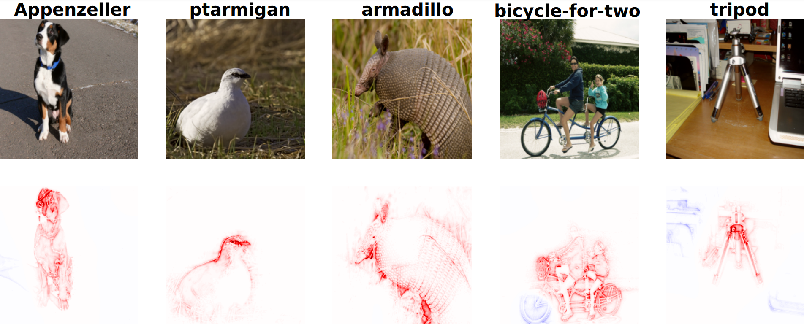
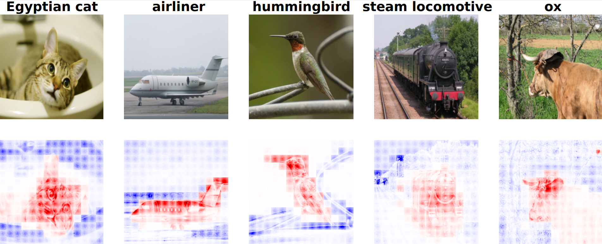
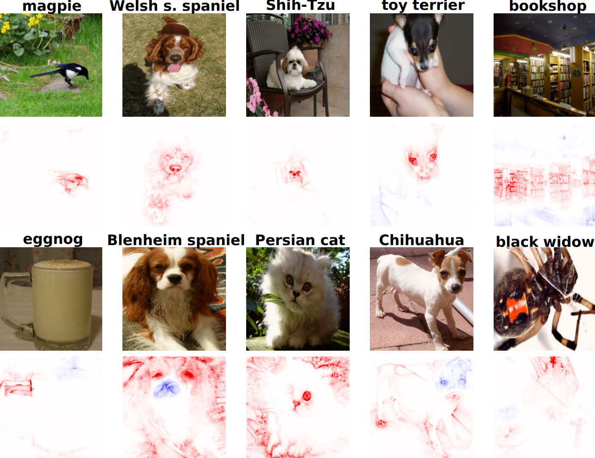

### Advancing Attribution-Based Explainability through Multi-Component Evaluation and Relative Absolute Magnitude Propagation

This repository contains the source code for the new __Relative Absolute Magnitude Propagation__ attribution method and the __Global Evaluation Metric__

#### Relative Absolute Magnitude Propagation

A novel Layer-Wise Propagation rule, referred to as Relative Absolute Magnitude Propagation (RAMP). This rule effectively addresses the issue of incorrect relative attribution between neurons within the same layer that exhibit varying absolute magnitude activations. We apply this rule to three different, including the very recent Vision Transformer.

*Figure 1. RAMP visualizations for VGG architecture - ImageNet*

*Figure 2. RAMP visualizations for Vision Transformer architecture - PascalVOC*

#### Global Evaluation Metric

A new evaluation method, Global Attribution Evaluation (GAE), which offers a novel perspective on evaluating faithfulness and robustness of an attribution method by utilizing gradient-based masking, while combining those results with a localization method to achieve a comprehensive evaluation of explanation quality in a single score.

*Figure 3. Top and bottom 5 scoring images on GAE metric out of a randomly sampled 1024 images - RAMP VGG ImageNet*